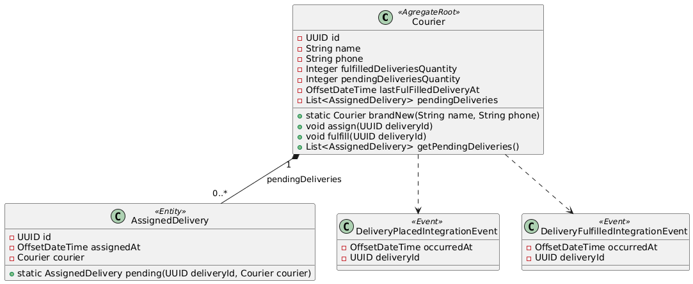
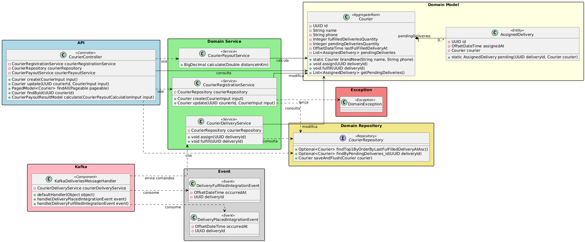

# Courier Management

O **Courier Management** é um microserviço responsável por gerenciar os **entregadores (Couriers)** e o **cumprimento das entregas (Deliveries)**.  
Ele faz parte do ecossistema de microsserviços do sistema de entregas, operando de forma **desacoplada** e comunicando-se por **eventos Kafka** com outros domínios.

---
## 🧭 Sumário
- [Tecnologias e Dependências](#-tecnologias-e-dependências)
- [Responsabilidades](#-responsabilidades)
- [Principais Endpoints](#-principais-endpoints)
- [Diagramas](#-diagramas)
- [Técnicas e Padrões de Programação Utilizados](#-técnicas-e-padrões-de-programação-utilizados)
- [Links Relacionados](#links-relacionados)

---

## 🛠️ Tecnologias e Dependências

| Tecnologia | Descrição | Link |
|-------------|------------|------|
| **Java 17** | Linguagem principal do projeto. | [https://www.oracle.com/java/](https://www.oracle.com/java/) |
| **Spring Boot** | Framework principal para configuração e execução do serviço. | [https://spring.io/projects/spring-boot](https://spring.io/projects/spring-boot) |
| **Spring Kafka** | Integração com o Apache Kafka para consumo de eventos. | [https://spring.io/projects/spring-kafka](https://spring.io/projects/spring-kafka) |
| **Spring Data JPA** | Abstração ORM para persistência no banco relacional. | [https://spring.io/projects/spring-data-jpa](https://spring.io/projects/spring-data-jpa) |
| **PostgreSQL** | Banco de dados relacional utilizado para persistência de dados. | [https://www.postgresql.org/](https://www.postgresql.org/) |
| **Lombok** | Reduz boilerplate code em entidades e DTOs. | [https://projectlombok.org/](https://projectlombok.org/) |
| **JUnit 5** | Framework de testes unitários. | [https://junit.org/junit5/](https://junit.org/junit5/) |
| **AssertJ** | Biblioteca de asserções fluentes. | [https://assertj.github.io/doc/](https://assertj.github.io/doc/) |
| **Mockito** | Framework para criação de mocks nos testes. | [https://site.mockito.org/](https://site.mockito.org/) |

--- 

## 🧩 Responsabilidades
- Modelar o entregador (Courier) e suas propriedades
- Calcular ganhos e disponibilidade
- Gerenciar rotas e atribuições
- Comunicar-se com o **Delivery Domain** para recebimento de tarefas
- Publicar eventos de atualização de status do entregador

---

## 📦 Principais Endpoints

| Método | Endpoint | Descrição |
|---------|-----------|-----------|
| `GET` | `/couriers` | Retorna a lista de entregadores registrados. |
| `GET` | `/couriers/{id}` | Retorna informações detalhadas de um entregador. |
| `POST` | `/couriers` | Registra um novo entregador. |

---

## 🧩 Diagramas
### Diagrama de classes

### Diagrama completo do módulo

---
## ⚙️ Técnicas e Padrões de Programação Utilizados

### Domain-Driven Design (DDD)
- Cada **agregado** representa uma **unidade consistente de regras de negócio**.
- O **`Courier`** é o **Aggregate Root**, responsável por coordenar o ciclo de vida de entregas (`Deliveries`) associadas a ele.
- A criação de entidades e *value objects* é feita de forma **controlada**, evitando instâncias inválidas.
- **Eventos de domínio** são disparados para notificar mudanças significativas, mantendo o código coeso e expressivo.

### Padrões de Projeto
| Padrão | Aplicação |
|--------|------------|
| **Aggregate Root** | `Courier` atua como o ponto de entrada e controle do agregado. |
| **Value Object** | Representa conceitos imutáveis de domínio, garantindo consistência sem identidade própria. |
| **Domain Events** | Encapsulam mudanças importantes no domínio (ex: `DeliveryFulfilledEvent`). |
| **Builder** | Facilita a criação de objetos complexos de teste e entidades de domínio de forma controlada. |
| **Service Layer** | Serviços de aplicação centralizam casos de uso e interações entre entidades. |

### Comunicação Assíncrona (Eventos)
- Utiliza o **Apache Kafka** para troca de informações entre microsserviços.
- O componente `KafkaDeliveriesMessageHandler` consome eventos publicados por outros microsserviços.
- Cada mensagem Kafka é convertida em um **comando de aplicação**, garantindo isolamento da lógica de negócio.
- Essa abordagem melhora a **escalabilidade**, **resiliência** e **independência entre domínios**.

### Estratégia de Eventos e Mensageria

- O **Courier Management** **não publica** eventos diretamente, mas **reage** a eventos externos (como entregas criadas ou finalizadas).
- O consumo é feito na **camada de infraestrutura**, mantendo o domínio puro.
- Cada evento recebido resulta em ações específicas no domínio, como:
    - Atualização de status de entrega.
    - Registro de disponibilidade do entregador.
- Essa abordagem garante um **baixo acoplamento** e uma **alta aderência ao DDD**.

### Testes
- Foram implementados **testes unitários** para validar as regras de negócio do domínio.
- Os testes garantem a integridade dos agregados (`Courier`, `Delivery`) e validam cenários críticos, como:
    - Cumprimento de entregas (`Delivery.fulfill()`).
    - Restrições de estado e consistência.
- **Tecnologias e estratégias:**
    - **JUnit 5** — Estrutura de testes moderna e modular.
    - **AssertJ** — Sintaxe fluente e expressiva para asserções.
    - **Mockito** — Simulação de dependências externas quando necessário.
- Os testes se concentram no **comportamento do domínio**, reforçando a confiabilidade da lógica central.

---
## Links Relacionados
- [Voltar ao README principal](../../README.md)
- [Delivery Tracking - README](../Delivery-Tracking/README.md)
- [Service Registry - README](../Service-Registry/README.md)
- [Gateway - README](../Gateway/README.md)