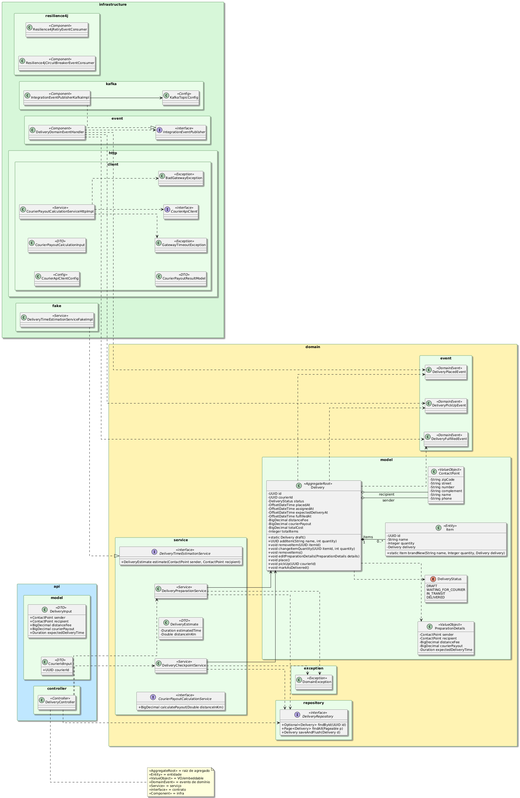

# Delivery Tracking

Este módulo é responsável por gerenciar entregas e acompanhar seu ciclo de vida.  

Ele segue uma arquitetura modular, com domínio isolado, integração assíncrona via **Kafka** e descoberta de serviços com **Eureka**.  
Toda a comunicação HTTP entre microsserviços é feita de forma resiliente, com **Resilience4j** garantindo estabilidade em caso de falhas.

---
## 📑 Sumário
- [Tecnologias e Dependências](#️-tecnologias-e-dependências)
- [Responsabilidades](#-responsabilidades)
- [Endpoints Principais](#-endpoints-principais)
- [Diagramas](#-diagramas)
- [Abordagens e Padrões de Programação](#-abordagens-e-padrões-de-programação--delivery-tracking)
- [Links Relacionados](#links-relacionados)

---

## 🛠️ Tecnologias e Dependências

| Tecnologia | Descrição | Link |
|-------------|------------|--------------|
| **Java 21** | Linguagem principal utilizada para o desenvolvimento do serviço. | [openjdk.org/projects/jdk/21](https://openjdk.org/projects/jdk/21/) |
| **Spring Boot 3.x** | Framework base que simplifica a configuração e execução do projeto. | [spring.io/projects/spring-boot](https://spring.io/projects/spring-boot) |
| **Spring Data JPA** | Abstração de persistência que simplifica o acesso ao banco de dados. | [spring.io/projects/spring-data-jpa](https://spring.io/projects/spring-data-jpa) |
| **Spring Cloud Netflix Eureka** | Mecanismo de descoberta de serviços utilizado entre os microsserviços. | [spring.io/projects/spring-cloud-netflix](https://spring.io/projects/spring-cloud-netflix) |
| **Spring Kafka** | Integração com Apache Kafka para comunicação assíncrona e eventos. | [spring.io/projects/spring-kafka](https://spring.io/projects/spring-kafka) |
| **Resilience4j** | Biblioteca para implementar tolerância a falhas, com retry e circuit breaker. | [resilience4j.readme.io](https://resilience4j.readme.io/) |
| **PostgreSQL** | Banco de dados relacional utilizado pelo serviço. | [postgresql.org](https://www.postgresql.org/) |
| **Lombok** | Reduz código boilerplate, fornecendo builders, getters/setters e construtores. | [projectlombok.org](https://projectlombok.org/) |
| **JUnit 5** | Framework de testes unitários e de integração. | [junit.org/junit5](https://junit.org/junit5/) |
| **Maven** | Ferramenta de build e gerenciamento de dependências do projeto. | [maven.apache.org](https://maven.apache.org/) |

---

## 🧩 Responsabilidades

- Modelagem do domínio de entregas (entidades e value objects)
- Cálculo de taxas de entrega, tempo estimado e distância
- Geração e publicação de eventos de domínio
- Representação do ciclo de vida da entrega (preparação, coleta, transporte, conclusão)
- Integração com o **Courier Domain** para obtenção de informações sobre o entregador

## 🌐 Endpoints Principais

| Método | Endpoint | Descrição |
|:-------|:----------|:-----------|
| `GET`  | `/deliveries` | Lista todas as entregas registradas |
| `GET`  | `/deliveries/{id}` | Detalha uma entrega específica |
| `POST` | `/deliveries` | Cria uma nova entrega |
| `PATCH` | `/deliveries/{id}/assign-courier` | Atribui um entregador à entrega |
| `PATCH` | `/deliveries/{id}/complete` | Finaliza uma entrega |

---

## 🧩 Diagramas
### Diagrama de classes

### Diagrama completo do módulo

---

## 📌 Abordagens e Padrões de Programação — *delivery-tracking*

### 1. Visão geral curta
O módulo segue princípios de **Domain-Driven Design (DDD)**, separa responsabilidades por camadas (API, Domain, Infrastructure), usa **events** de domínio para integração assíncrona e aplica padrões de resiliência (Resilience4j) e descoberta de serviços (Eureka). Persistência via JPA/Postgres e mensageria via Apache Kafka.

---

### 2. Principais Padrões e Técnicas Utilizadas

- **Domain-Driven Design (DDD)** — modelagem explícita de agregados, value objects, entidades e eventos de domínio.
- **Aggregate Root** — `Delivery` estende `AbstractAggregateRoot`, garantindo controle sobre o ciclo de vida do agregado.
- **Factory Method** — `Delivery.draft()` cria rascunhos consistentes com estado inicial válido.
- **Encapsulamento forte** — construtores e setters privados, evitando alterações indevidas fora do agregado.
- **Value Objects** — como `ContactPoint`, usados para representar conceitos imutáveis e expressivos.
- **Builders (Lombok @Builder)** — facilitam a criação legível e segura de objetos complexos.
- **Static Factory em Entidades Filhas** — métodos como `Item.brandNew(...)` garantem consistência interna do agregado.
- **Enum com Regras de Transição** — `DeliveryStatus` define internamente quais transições são válidas (`canNotChangeTo`), evitando ifs espalhados.
- **Domain Events** — eventos como `DeliveryPlacedEvent` ou `DeliveryFulfilledEvent` representam fatos de negócio e são publicados pelo agregado.
- **Event-driven Integration** — integração assíncrona via `IntegrationEventPublisher` e **Kafka**, desacoplando domínio da infraestrutura.
- **Repository Pattern (Spring Data JPA)** — abstrai persistência e consultas.
- **Separation of Concerns** — domínio, infraestrutura e aplicação bem delimitados.
- **Resilience4j** — aplicado em requisições HTTP para retry e circuit breaker.
- **Testes unitários e de integração** — cobertura completa das regras de domínio e persistência.

---

### 3. Como o Aggregate `Delivery` é projetado (destaques)
- **Criação controlada:** o método `Delivery.draft()` assegura a inicialização do agregado com valores consistentes.
- **Encapsulamento:** setters privados e construtores com `AccessLevel.PACKAGE` impedem modificações externas.
- **Mudança de estado por comportamento:** métodos como `place()`, `pickUp()`, `markAsDelivered()` encapsulam regras de negócio.
- **Eventos de domínio:** cada mudança relevante aciona um evento (`super.registerEvent(...)`), que será publicado pelo handler correspondente.

---

### 4. Value Objects e Builders
- **`ContactPoint`** — implementado como `@Embeddable` e `@Builder`, garantindo imutabilidade e semântica de domínio.
- **`Delivery.PreparationDetails`** — encapsula informações de preparação de entrega (remetente, destinatário, taxas, etc).
- **Motivação:** melhora legibilidade, reduz erros e garante integridade sem depender de construtores longos.

---

### 5. Enums e controle de estado
- **`DeliveryStatus`** implementa as regras de transição (quem pode ir para quem), centralizando a lógica de fluxo de estados.
    - Método `canNotChangeTo` torna as verificações expressivas e testáveis.
- **Benefício:** evita condicionais dispersos e facilita testes unitários do fluxo de estado.

---

### 6. Eventos de Domínio → Integração com Kafka
- **Fluxo:**
    - `Delivery` registra eventos (ex.: `DeliveryPlacedEvent`) via `AbstractAggregateRoot.registerEvent`.
    - `DeliveryDomainEventHandler` é anotado com `@EventListener` e captura os eventos de domínio.
    - `DeliveryDomainEventHandler` delega a publicação para `IntegrationEventPublisher`.
    - `IntegrationEventPublisherKafkaImpl` usa `KafkaTemplate<String,Object>` para enviar eventos ao tópico `deliveries.v1.events`.
- **Tópico configurado:** `KafkaTopicConfig.deliveryEventsTopicName = "deliveries.v1.events"` (criado via `NewTopic` com 3 partitions).
- **Observação técnica:** o publisher chama `.join()` no `SendResult` para obter `RecordMetadata` (uso síncrono aqui para logging/controle).

---

### 7. Comunicação HTTP entre serviços e resiliência
- **Cliente HTTP declarativo:** `CourierApiClient` define chamadas com `@HttpExchange` / `@PostExchange` e é criado via `HttpServiceProxyFactory` sobre `RestClient`.
- **Load-balanced client:** `RestClient.Builder` é exposto como `@Bean @LoadBalanced` — permitindo resolver `http://courier-management` via Eureka.
- **Resilience4j:** métodos do cliente possuem `@Retry` e `@CircuitBreaker` configurados (nomes ligados ao `application.yml`).
- **Tratamento de exceções:** `CourierPayoutCalculationServiceHttpImpl` traduz exceções (`ResourceAccessException` → `GatewayTimeoutException`, `HttpServerErrorException` → `BadGatewayException`) para respostas HTTP apropriadas.
- **Tempo de timeout personalizado:** `CourierApiClientConfig` define `connect` e `read` timeouts na factory.

---

### 8. Pacote `infrastructure.fake` — propósito
- `DeliveryTimeEstimationServiceFakeImpl` implementa a interface `DeliveryTimeEstimationService` com comportamento determinístico (retorna estimativa fixa).
- **Objetivo prático:** prover uma implementação substituta para desenvolvimento e testes locais, permitindo que a preparação de entregas funcione sem depender de serviços externos.
- **Benefícios:**
    - acelera desenvolvimento;
    - torna testes mais previsíveis (sem flakiness);
    - permite trocar facilmente por uma implementação real no futuro (Inversão de Dependência).

---

### 9. Testes — cobertura e estratégias
- **Tipos de testes presentes:**
    - **Unit tests (JUnit 5):** `DeliveryTest` e `DeliveryStatusTest` verificam comportamento do agregado e regras de transição.
    - **Integration / Repository tests:** `DeliveryRepositoryTest` usa `@DataJpaTest` com `@AutoConfigureTestDatabase(replace = NONE)` para persistir contra o banco real configurado (testes que cobrem JPA/Hibernate mappings).
    - **Application context smoke test:** `DeliveryTrackingApplicationTests.contextLoads()` garante que o contexto Spring sobe corretamente.
- **Estratégia:**
    - testar regras de domínio isoladas (teste puro do agregado);
    - testar persistência separadamente com `DataJpaTest` (sem mocks) para garantir mapeamentos/relacionamentos;
    - evitar testes end-to-end pesados no domínio — usar testes de integração específicos quando necessário.
- **Ferramentas:** JUnit 5 (spring-boot-starter-test), Spring Test slices (`@DataJpaTest`), uso de configuração para testar com banco real.

---
## Links Relacionados
- [Voltar ao README principal](../../README.md)
- [Courier Management - README](../Courier-Management/README.md)
- [Service Registry - README](../Service-Registry/README.md)
- [Gateway - README](../Gateway/README.md)

