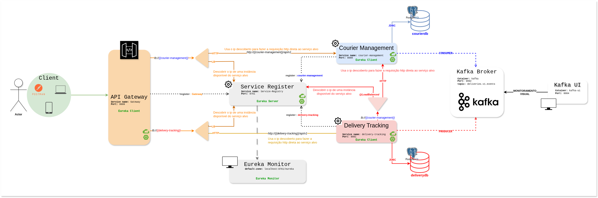

# 📦 Delivery System - Microservices Architecture

Este projeto faz parte de uma arquitetura de microserviços desenvolvida durante a **Imersão Microserviços - Algaworks**.  
O sistema simula o fluxo completo de entregas, desde o gerenciamento de entregadores até o rastreamento das entregas em andamento.

---

## 🚀 Visão Geral

O sistema é composto por múltiplos microserviços independentes que se comunicam entre si via **HTTP balanceado com Eureka** (Service Discovery), utilizando o ecossistema **Spring Cloud**.  
O **Service Registry (Eureka)** atua como ponto central de descoberta, permitindo que os serviços se encontrem dinamicamente sem dependência de endereços fixos.

---

## 🧱 Estrutura do Projeto

Os principais módulos são:

- **service-registry** – Eureka Server (porta `8761`) — *fora do Docker* no seu ambiente atual.
- **gateway** – API Gateway (porta `9999`) — roteamento via Eureka (`lb://...`).
- **delivery-tracking** – Serviço de entregas (publica eventos Kafka e expõe endpoints REST).
- **courier-management** – Serviço de couriers (consome eventos Kafka e expõe endpoints REST).
- **kafka + kafka-ui** – Broker e UI em containers (conforme `docker-compose`).
- **postgres** – container PostgreSQL (host-mapped `5435:5432` conforme `docker-compose`).

Cada serviço tem seu próprio banco/namespace (princípio *database per service*).

---

## 🛠️ Tecnologias Utilizadas

| Tecnologia | Descrição | Link Oficial |
|-----------:|:----------|:-------------|
| Java 21 | Linguagem principal da aplicação | https://www.oracle.com/java/ |
| Spring Boot | Framework para construção dos microserviços | https://spring.io/projects/spring-boot |
| Spring Cloud | Ferramentas para microsserviços (Eureka, Gateway, LoadBalancer) | https://spring.io/projects/spring-cloud |
| Spring Cloud Netflix Eureka | Registro e descoberta de serviços | https://cloud.spring.io/spring-cloud-netflix/reference/html/ |
| Spring Cloud Gateway | API Gateway para roteamento e filtros | https://spring.io/projects/spring-cloud-gateway |
| Spring Kafka | Integração com Apache Kafka | https://spring.io/projects/spring-kafka |
| Apache Kafka | Broker de mensageria assíncrona | https://kafka.apache.org/ |
| PostgreSQL | Banco relacional usado por cada serviço | https://www.postgresql.org/ |
| Docker / Docker Compose | Containerização e orquestração local | https://www.docker.com/ / https://docs.docker.com/compose/ |
| Maven | Gerenciamento de dependências e build | https://maven.apache.org/ |
| Lombok | Redução de boilerplate | https://projectlombok.org/ |
| Resilience4j | Circuit breaker / retry | https://resilience4j.readme.io/ |

---

## 🧩 Arquitetura e Comunicação

**Padrões principais:**

- **HTTP via Gateway:**  
  Cliente externo → **API Gateway** (`http://localhost:9999`) → roteamento para serviços via `lb://service-id` (Gateway consulta o Eureka para obter endereços).

- **HTTP interno entre serviços:**  
  Serviços (ex.: `delivery-tracking`) usam `@LoadBalanced` (RestClient / RestTemplate / WebClient builder) para resolver `http://courier-management/...` — o cliente consulta o Eureka (ou usa cache local atualizado) e faz a chamada **direta** para a instância escolhida. **O tráfego não passa pelo Eureka**; o Eureka fornece apenas os endereços.

- **Mensageria (Kafka):**  
  `delivery-tracking` publica eventos no tópico `deliveries.v1.events`.  
  `courier-management` consome esse tópico via `@KafkaListener`.  
  O broker Kafka e o Kafka UI estão no `docker-compose`.

- **Persistência:**  
  Cada serviço utiliza PostgreSQL via JDBC (cada um com seu schema/DB).


 **Diagrama da Arquitetura:**



---
## 📁 Especificações dos microserviços

- [Courier Management Service - README](Microservices/Courier-Management/README.md)
- [Delivery Tracking Service - README](Microservices/Delivery-Tracking/README.md)

---

## 🧩 Como Executar o Projeto Localmente

Siga as etapas abaixo para executar todo o ambiente de forma local, incluindo o Eureka, os microserviços e o ambiente de mensageria (Kafka + Postgres).

---

### 🐳 1. Subir os containers de infraestrutura

O projeto utiliza **Docker Compose** para subir os serviços auxiliares:
- **Kafka** (broker de eventos)
- **Kafka UI** (interface de visualização dos tópicos e mensagens)
- **PostgreSQL** (banco de dados dos microserviços)

Execute no diretório raiz do projeto:

```bash
  docker-compose up -d
```

### ⚙️ 2. Iniciar o Service Registry (Eureka Server)
O Eureka Server deve ser executado fora do Docker, pois os demais serviços estão configurados para registrar-se nele via rede do host.
```bash
  cd service-registry
  mvn spring-boot:run
```

Acesse o painel do Eureka em: 👉 http://localhost:8761

Você verá a lista dos microserviços conforme eles forem subindo.

---
### 🧠 3. Iniciar os Microserviços
```bash
  cd gateway
  mvn spring-boot:run
```
```bash
  cd delivery-tracking
  mvn spring-boot:run
```
```bash
  cd courier-management
  mvn spring-boot:run
```
🔍 Aguarde até que todos apareçam como UP no painel do Eureka (http://localhost:8761).

---

### 🌐 4. Acessar o Gateway e os Endpoints
Todas as requisições externas devem ser feitas via API Gateway, que realiza o roteamento automático com base nos nomes lógicos dos serviços registrados no Eureka.

Exemplo de requisição:

```bash
  curl -X GET http://localhost:9999/api/v1/deliveries
```


### 💬 5. Testar com o Postman
Uma collection Postman com os endpoints configurados está disponível na pasta:
`/DOCS/DeliverySystem.postman_collection.json`

### 📊 6. Visualizar Mensagens no Kafka

Após publicar eventos no sistema (delivery-tracking → courier-management):

Acesse o Kafka UI em:
👉 http://localhost:8089

Você poderá ver os tópicos, mensagens e consumidores registrados.

---

### ✍️ Autor


Desenvolvido durante a **Imersão Microserviços - Algaworks**  
por **Marcos Winicios**.
